# Procena broja stanovnika iz satelitskih snimaka

Projekat iz Dubokog učenja (DMI, UNSPMF). Duboki modeli procenjuju broj stanovnika
naselja u Srbiji (bez Kosova i Metohije) iz javno dostupnih podataka daljinskog
osmatranja; procene se porede sa zvaničnim popisom 2022. Tim: Nikola Jarić i
Aleksandar Zdravković.

```mermaid
flowchart LR
  S["Sentinel-2 L2A<br/>openEO"] --> P1["1 · pločice 2.24 km<br/>ResNet-18, loss na sumi"]
  O["Overture<br/>otisci zgrada"] --> P2["2 · 14 atributa<br/>MLP · GBM · TabFM"]
  O --> P2b["2b · raster 2 kanala<br/>ResNet-18"]
  S --> F2["F2 · multimodalni<br/>2 trupa + MLP grana"]
  O --> F2
  P1 --> F1["F1 · stacking<br/>Ridge u log prostoru"]
  P2 --> F1
  F2 --> F1
  P2b -. "odbačen: R²log 0.67" .-> F1
  C["Popis 2022<br/>RZS"] --> L(["labela: log1p(pop)"])
```



## Pristupi

Dva komplementarna osnovna pristupa i dva načina fuzije:

| # | Notebook | Ulaz | Ideja |
|---|---|---|---|
| 1 | `02_tiles_train.ipynb` | Sentinel-2 pločice 2.24 km | broj stanovnika po pločici (softplus), suma pločica = naselje, loss na sumi; naselja variraju od sela do grada, pa fiksan isečak po naselju ne radi (MAUP) |
| 2 | `03_footprint_train.ipynb` | 14 strukturiranih atributa otisaka zgrada po naselju, svi iz geometrije (količina, oblik, raspored) | MLP na `log1p(pop)`; gradient boosting kao referentna linija |
| 2b | `03_footprint_train.ipynb` | isti otisci, rasterizovani u 2 kanala (pokrivenost, gustina zgrada) | ResNet-18 regresija na `log1p(pop)`: da li prostorni raspored nosi nešto preko brojača? |
| 2c | `03_footprint_train.ipynb` | isti atributi, isti foldovi | TabFM (tabelarni foundation model, Google, jun 2026): bez treninga po foldu, ceo fold ide u kontekst, predikcija u jednom forward prolazu; jednom sa `log1p` atributima, jednom sa sirovima |
| F1 | `05_fusion_train.ipynb` | OOF predikcije pristupa 1/2/2b i F2 | stacking (Ridge u log prostoru) + post-hoc kalibracija po pristupu; bez GPU-a |
| F2 | `04_multimodal_train.ipynb` | Sentinel isečak + footprint raster + 14 strukturiranih atributa istog naselja | jedan model koji istovremeno dobija strukturirane podatke i sliku: dva ResNet-18 trupa (512-dim svaki) + MLP grana (32-dim), konkatenacija u zajedničku glavu, end-to-end |

Svi pristupi dele isti evaluacioni protokol (`core`): 5-struka GroupKFold
podela po opštinama (bez prostornog curenja između trening i validacionog skupa),
out-of-fold (OOF) predikcija za svako naselje tačno jednom, isti skup metrika i
rezime grafik; rezultati su direktno uporedivi između pristupa.

## Metrike

Raspodela populacije je ekstremno iskošena (medijana naselja ~265, Beograd ~1.4M),
pa prosečne apsolutne greške i linearni R² na sumama dominiraju najveći gradovi.
Glavne metrike su zato: `oof_r2_log` (R² u log1p prostoru), `oof_medape`
(medijalna procentualna greška), `oof_wmape` (relativna greška ponderisana
populacijom) i `oof_bias` (Σpred/Σstvarno). Dijagnostika: `oof_kalib_nagib`
(nagib log-log regresije; > 1 = kompresija predikcija ka sredini), medAPE po
veličinskim stratumima naselja i opštinska agregacija sa i bez dve najveće
opštine.

Skup je namerno sveden na 13 ključeva. Izostavljeni su `oof_rmse_log`
(determinisana funkcija `oof_r2_log`, varijansa je ista za sve pristupe),
`oof_mae_log` (log jedinice se ne tumače), `oof_rmse_stanovnici` (kvadrat
greške u stanovnicima ga svodi na Beograd), linearni `oof_opstina_r2` sa i bez
top-2 (na rasponu opština 5k-1.6M ga nose ili ruše dva grada), i `oof_n_<strat>`
sa `oof_mae_<strat>` (prvo opisuje skup a ne run, drugo samo ponavlja da velika
naselja imaju velike apsolutne greške).

Opštinska agregacija se računa sa i bez dve najveće opštine jer to razdvaja
"model ne radi" od "megagradovi se ne ekstrapoliraju u GroupKFold-u", a medAPE
po stratumima pokazuje gde model radi a gde ne. Računa ih `core.cv.oof_metrics`.

Kompresiju predikcija ka sredini ispravlja post-hoc kalibracija u
`05_fusion_train`: za **svaki** pristup, pod istim foldovima, uči se monotona
funkcija predviđeno → ispravljeno (Ridge nagib+presek u log-log, i isotonic).
Monotona je pa ne menja redosled naselja, popravlja skalu, ne rangiranje.

## Rezultati

Brojke sa oznakom izvora su u [`results/metrike_po_pristupu.csv`](results/metrike_po_pristupu.csv),
koji pravi `scripts.report` iz izvršenih svesaka. Grafovi su u [`figures/`](figures/).

### Labele su proverene pre modeliranja

Spajanje popisa sa geometrijom naselja pogađa **99,98%** — 4.721 naselje u 168 opština —
a zbir se poklapa sa zvaničnim popisnim brojem stanovnika **6.646.833**.

Popunjenost Overture polja je merena, ne pretpostavljena: **spratnost postoji na 0,76%
zgrada, visina na 0,05%**, i to neravnomerno po okruzima. Zato je procena izgrađene
zapremine (spratnost × osnova) odbačena, a svi atributi izvedeni iz 2D geometrije.

### Poređenje pristupa, presek od 910 naselja

Presek je uzet zato što toliko naselja ima **istovremeno** i satelitski isečak i otiske;
tabelarni model je treniran na svih 4.720, gde daje R²log 0,875.

| Pristup | R²log | medAPE | wMAPE |
|---|---|---|---|
| Satelitske pločice (1) | `0.810` ▇▇▇▇▇▇···· | 0.41 | 0.78 |
| Otisci — tabelarni (2) | `0.905` ▇▇▇▇▇▇▇▇▇· | 0.25 | 0.42 |
| Multimodalni (F2) | `0.880` ▇▇▇▇▇▇▇▇·· | 0.35 | 0.57 |
| **Fuzija — stacking (F1)** | `0.925` ▇▇▇▇▇▇▇▇▇· | 0.24 | 0.39 |

**Fuzija stackingom je najbolja od svega.** Meta-model najviše težine daje otiscima
(koeficijent 0,59), uz po 0,26 za pločice i multimodalni. Zajednički multimodalni model
(0,880) **nije nadmašio svoj najbolji pojedinačni ulaz** (0,905) — to je nalaz, ne greška
u treningu.

Na nivou opština R²log je 0,815, odnosno 0,861 bez dva najveća grada. Greška raste sa
veličinom naselja: medAPE 0,16 za naselja od 500 do 5.000 stanovnika, do 0,47 za naselja
preko 50.000.

### Raster ne nosi ništa preko brojača

Na preseku od 912 naselja, iz predatog pokretanja: tabelarni model `0.906`, GBM `0.903`,
**raster (ResNet nad 2 kanala) `0.669`**. Prostorni raspored zgrada ne dodaje informaciju
preko golih brojača, pa je 2b izostavljen iz fuzije.

> Ta tabela nije u `metrike_po_pristupu.csv`: ćelija koja je računa proširena je uz
> pristup 2c da obuhvati i TabFM, pa nema izvršen izlaz od te izmene. Vraća se u tabelu
> čim se sveska 03 ponovo pusti do kraja.

### TabFM naspram MLP-a i GBM-a, svih 4.720 naselja

Isti foldovi, isti atributi, razlika je samo u modelu:

| Model | R²log | medAPE | wMAPE | bias | opština R²log |
|---|---|---|---|---|---|
| MLP | `0.875` | 0.29 | **0.34** | 0.86 | 0.84 |
| GBM | `0.862` | 0.29 | **0.35** | 0.87 | 0.86 |
| **TabFM** | `0.877` | 0.26 | **0.21** | 0.94 | 0.92 |

Po R²log se skoro ništa ne menja. **Razlika je u agregatnim metrikama**: wMAPE pada sa
0,34 na 0,21, bias sa 0,86 na 0,94, opštinski R²log ide sa 0,84 na 0,92. Kod MLP-a i
GBM-a se greška na velikim naseljima skuplja u zbiru; TabFM se sa njima snalazi bolje.
Ako je predmet interesovanja zbir a ne rang naselja, to je važniji nalaz od samog R².

### Kompresije predikcija praktično nema

Post-hoc kalibracija skoro ništa ne menja, jer su nagibi na log-log skali već blizu 1
(1,00 do 1,08). Dijagnostika je zato ostala kao provera, ne kao ispravka.

## Struktura

```
core/                  zajednicki modul (uvoze ga svi treniracki notebooci)
  data.py              normalizacija po opsegu, Dataset, DataLoader-i
  train.py             seeding, trening/eval prolaz, dvofazni trening (glava -> fine-tuning)
  cv.py                GroupKFold foldovi, OOF metrike, CV rezime grafik
  environment.py       MLflow tracking, izlazni dir, cuvanje OOF-a (koren okruzenja iz scripts/config.py)
notebooks/             Jupyter notebooci; prefiks = redosled pokretanja
  01_eda.ipynb              analiza podataka: jedinice, populacija, footprinti, snimci
  02_tiles_train.ipynb      pristup 1 (plocice + agregacioni loss, log vs linear)
  03_footprint_train.ipynb  pristup 2 (tabelarni MLP + GBM referenca), 2b (CNN nad rasterom), 2c (TabFM)
  04_multimodal_train.ipynb fuzija F2 (zajednicki trogranski model: 2 slike + atributi)
  05_fusion_train.ipynb     fuzija F1 (stacking nad OOF predikcijama 02-04)
scripts/               priprema podataka (lokalno; paket, pokrece se sa -m)
  config.py            sve putanje i detekcija okruzenja; uvoze ga skripte, notebooci i core
  preprocessing/       labele i master tabela naselja, zajednicko svim pristupima
  sentinel/            satelitski ulazi: kompoziti, isecci (za F2), plocice (pristup 1)
  footprint/           otisci zgrada: strukturirani atributi (pristup 2),
                       rasterizacija (2b), coverage provera
results/               terminalne tabele i sazeci (.csv, .json)
  report.py            prilozi iz izvrsenih notebooka: grafovi -> figures/,
                       tabela metrika -> results/ (ne trazi ni data/ ni MLflow)
figures/               grafovi (.png) izvuceni iz izvrsenih notebooka; pravi ih scripts.report
data/                  nije u repozitorijumu (preveliko; prenosi se na Databricks UC Volume)
requirements.txt       zavisnosti za lokalni rad
```

`05_fusion_train` je numerisan poslednji jer jedini cita tudje izlaze
(`oof_<pristup>.parquet`); 02-04 su medjusobno nezavisni.

Izlazi runa (`out/`, `mlruns/`, `.pt` tezine, `oof_*.parquet`) se ne cuvaju u
git-u, regenerisu se pokretanjem i ostaju uz MLflow run kao artefakti.

## Izvori podataka

| Uloga | Izvor |
|---|---|
| Snimci (ulaz) | Sentinel-2 L2A, Copernicus Data Space / openEO (https://dataspace.copernicus.eu) |
| Geometrija naselja | Registar prostornih jedinica, GeoSrbija (https://download.geosrbija.rs) |
| Broj stanovnika (labela) | Popis 2022, RZS (https://popis2022.stat.gov.rs/sr-latn/popisni-podaci-eksel-tabele/) |
| Otisci zgrada | Overture Maps (https://docs.overturemaps.org/guides/buildings/) |

Polazna referenca: Yeh et al., *Using publicly available satellite imagery and deep
learning to understand economic well-being in Africa*, Nature Communications (2020).

## Priprema podataka (lokalno, redom)

```
pip install -r requirements.txt
```

Skripte su paket, pa se pokreću iz korena repoa sa `-m` (tako `from scripts
import config` radi bez petljanja po `sys.path`). Redosled nije proizvoljan:
svaki korak čita izlaz nekog ranijeg:

```
python -m scripts.preprocessing.build_labels        # RZS popis .xlsx + geometrija -> naselje_pop_final.csv
python -m scripts.preprocessing.make_dataset_table  # master tabela (centroid, okrug, area) -> naselje_table.parquet
python -m scripts.footprint.per_naselje             # Overture otisci -> 14 atributa po naselju iz geometrije (pristup 2)
python -m scripts.sentinel.cutouts subset           # openEO: kompozit po okrugu -> 1 isecak po naselju
python -m scripts.footprint.rasters                 # otisci -> 2-kanalni rasteri: pokrivenost + gustina (pristup 2b)
python -m scripts.sentinel.tiles                    # kompoziti -> plocice 2.24 km (pristup 1)
```

Gotov `data/` se onda prenosi na Databricks UC Volume, odakle ga notebooci čitaju.

Zavisnosti (zašto baš taj redosled):

```
preprocessing.build_labels
  └─> preprocessing.make_dataset_table
        ├─> footprint.per_naselje ─┐
        │                          ├─> footprint.rasters
        └─> sentinel.cutouts ──────┤
                                   └─> sentinel.tiles
```

`footprint.per_naselje` i `sentinel.cutouts` mogu paralelno, oba traže samo
`naselje_table.parquet`. `footprint.rasters` i `sentinel.tiles` oba traže i
otiske iz Overture i Sentinel izlaz: rasterizacija zato što crta zgrade preko
isečka, a pločice zato što centroidima zgrada odbacuju prazne.

Van pipeline-a, dijagnostika (traži samo `build_labels`, ne ulazi ni u šta):

```
python -m scripts.footprint.coverage                # pokrivenost Overture otiscima u selima
```

Uzorkuje 6 sela (pop 50-800) i 2 depopulaciona naselja (pop 1-20) i izveštava broj
zgrada, krovnu površinu i izvore. Provera rizika za pristup 2: ako su ML-generisani
otisci retki u selima, izgrađenost je nepouzdan signal baš tamo gde je populacija
najmanja. Rezultat ide u `results/rural_footprints.csv`, odakle ga `01_eda` čita.

Prilozi za izveštaj (traži samo izvršene sveske, ni `data/` ni pristup MLflow-u):

```
python -m scripts.report                            # grafovi -> figures/, metrike -> results/
```

Trening je išao na Databricks-u, pa grafovi i tabele metrika stoje kao MLflow artefakti
i ugrađeni izlazi u `.ipynb`. Skripta ih raspakuje: PNG-ove u `figures/`, a poređenje
pristupa u `results/metrike_po_pristupu.csv`, uz `n_naselja` (03 i 05 evaluiraju na svom
preseku) i `izvor` svesku.

**Gde šta ide** (putanje su u [`scripts/config.py`](scripts/config.py), skripte
ih uvoze odatle umesto da svaka sklapa svoje):

| | sadržaj | u gitu |
|---|---|---|
| `data/` | ulazi i međukoraci: sve što neki sledeći korak čita kao ulaz: geometrije, isečci, pločice, `naselje_table.parquet`, `naselje_pop_final.csv` | ne (preveliko) |
| `results/` | terminalne tabele i sažeci (`.csv`, `.json`) | da |
| `figures/` | grafovi (`.png`), raspakovani iz izvršenih svesaka | da |
| `out/`, MLflow | težine po foldu, OOF predikcije, rezime grafici runa | ne (regeneriše se) |

Terminalno = niko to dalje ne konzumira kao ulaz, nego se gleda ili predaje.

## Trening

**Databricks** (primarno): repo je povezan kao Databricks Repo; podaci su
preneti na UC Volume (`.../raw_data/data`). Otvoriti notebook i `Run all`:
putanje, MLflow tracking i izlazi se podese sami. Redosled za fuziju: prvo
trenirački notebooki (1/2 i F2 `04_multimodal_train`, koji trenira iz sirovih
ulaza, svaki snimi `oof_<pristup>.parquet`), pa `05_fusion_train`. `05_fusion_train`
uzima svaki OOF parquet koji zatekne, pa radi i sa podskupom pristupa. GBM i TabFM iz
`03` ostaju van fuzije: nad istim su atributima kao tabelarni MLP, pa bi ulazi meta-modela
bili gotovo kolinearni.

TabFM skida težine sa Hugging Face-a (`google/tabfm-1.0.0-pytorch`) pri prvom učitavanju,
bez naloga i tokena. Kod je Apache-2.0, težine su pod `tabfm-non-commercial-v1.0`, dakle
samo za nekomercijalnu upotrebu. Traži Python >= 3.11.

**Lokalno** (za razvoj i EDA): `pip install -r requirements.txt`, pa
`jupyter lab`. Bez `/databricks` na disku `core.environment` sam prelazi na
`out/` za težine i OOF, i na lokalni `mlruns/` za metrike. Ako su postavljeni
`DATABRICKS_HOST` i `DATABRICKS_TOKEN`, metrike umesto toga idu u zajednički
Databricks eksperiment. Trening celog skupa lokalno nema smisla bez GPU-a:
lokalno se pokreće `01_eda` i `05_fusion_train` (fuzija ne traži GPU).

Svaki run se prati kroz MLflow: hiperparametri, metrike po epohi, OOF metrike,
rezime grafik, težine po foldu i OOF parquet kao artefakti.
