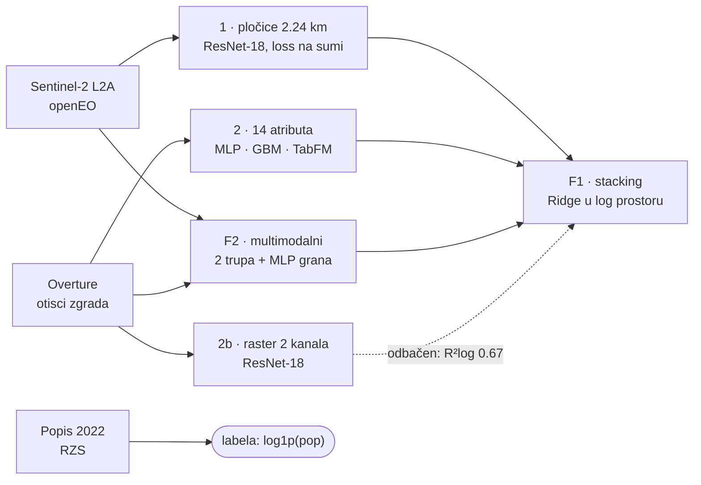

# Procena broja stanovnika iz satelitskih snimaka

Projekat iz Dubokog učenja (DMI, UNSPMF). Duboki modeli procenjuju broj stanovnika
naselja u Srbiji (bez Kosova i Metohije) iz javno dostupnih podataka daljinskog
osmatranja; procene se porede sa zvaničnim popisom 2022. Tim: Nikola Jarić i
Aleksandar Zdravković.



## Pristupi

Dva komplementarna osnovna pristupa i dva načina fuzije:

| # | Notebook | Ulaz | Ideja |
|---|---|---|---|
| 1 | `02_tiles_train.ipynb` | Sentinel-2 pločice 2.24 km | broj stanovnika po pločici (softplus), suma pločica = naselje, loss na sumi; naselja variraju od sela do grada, pa fiksan isečak po naselju ne radi (MAUP) |
| 2 | `03_footprint_train.ipynb` | 14 strukturiranih atributa otisaka zgrada po naselju, svi iz geometrije (količina, oblik, raspored) | MLP na `log1p(pop)`; gradient boosting kao referentna linija |
| 2b | `03_footprint_train.ipynb` | isti otisci, rasterizovani u 2 kanala (pokrivenost, gustina zgrada) | ResNet-18 regresija na `log1p(pop)`: da li prostorni raspored nosi nešto preko brojača? |
| 2c | `03_footprint_train.ipynb` | isti atributi, isti foldovi | TabFM (tabelarni foundation model, Google, jun 2026): bez treninga po foldu, ceo fold ide u kontekst, predikcija u jednom prolazu |
| F1 | `05_fusion_train.ipynb` | OOF predikcije pristupa 1/2/2b i F2 | stacking (Ridge u log prostoru) + post-hoc kalibracija po pristupu; bez GPU-a |
| F2 | `04_multimodal_train.ipynb` | Sentinel isečak + footprint raster + 14 strukturiranih atributa istog naselja | dva ResNet-18 trupa (512-dim svaki) + MLP grana (32-dim), konkatenacija u zajedničku glavu, end-to-end |

Svi pristupi dele isti evaluacioni protokol (`core`): 5-struka GroupKFold
podela po opštinama (bez prostornog curenja između trening i validacionog skupa),
out-of-fold (OOF) predikcija za svako naselje tačno jednom, isti skup metrika i
rezime grafik; rezultati su direktno uporedivi između pristupa.

Raspodela populacije je ekstremno iskošena (medijana naselja ~265, Beograd ~1,4M), pa bi
prosečne apsolutne greške i linearni R² na sumama merili samo najveće gradove. Glavne
metrike su zato R² u log1p prostoru, medijalna procentualna greška (medAPE), relativna
greška ponderisana populacijom (wMAPE) i bias kao odnos zbirova. Opštinska agregacija se
računa i bez dve najveće opštine, jer to razdvaja "model ne radi" od "megagradovi se ne
ekstrapoliraju u GroupKFold-u". Sve računa `core.cv.oof_metrics`.

## Rezultati

Brojke sa oznakom izvora su u
[`results/metrike_po_pristupu.csv`](results/metrike_po_pristupu.csv), koji pravi
`scripts.report` iz izvršenih svesaka, bez pristupa Databricks nalogu. Grafovi su u
[`figures/`](figures/).

### Labele su proverene pre modeliranja

Spajanje popisa sa geometrijom naselja pogađa **99,98%**, to jest 4.721 naselje u 168 opština,
a zbir se poklapa sa zvaničnim popisnim brojem stanovnika **6.646.833**.

Popunjenost Overture polja je merena, ne pretpostavljena: **spratnost postoji na 0,76%
zgrada, visina na 0,05%**, i to neravnomerno po okruzima. Zato je procena izgrađene
zapremine (spratnost × osnova) odbačena, a svi atributi izvedeni iz 2D geometrije.

### Poređenje pristupa, presek od 910 naselja

Presek je uzet zato što toliko naselja ima **istovremeno** i satelitski isečak i otiske;
tabelarni model je treniran na svih 4.720, gde daje R²log 0,875.

| Pristup | R²log | medAPE | wMAPE |
|---|---|---|---|
| Satelitske pločice (1) | `0.810` ▇▇▇▇▇▇···· | 0.41 | 0.78 |
| Otisci, tabelarni (2) | `0.905` ▇▇▇▇▇▇▇▇▇· | 0.25 | 0.42 |
| Multimodalni (F2) | `0.880` ▇▇▇▇▇▇▇▇·· | 0.35 | 0.57 |
| **Fuzija, stacking (F1)** | `0.925` ▇▇▇▇▇▇▇▇▇· | 0.24 | 0.39 |

**Fuzija stackingom je najbolja od svega.** Meta-model najviše težine daje otiscima
(koeficijent 0,59), uz po 0,26 za pločice i multimodalni. Zajednički multimodalni model
(0,880) **nije nadmašio svoj najbolji pojedinačni ulaz** (0,905): to je nalaz,
a ne greška u treningu. Na nivou opština R²log je 0,815, odnosno 0,861 bez dva najveća
grada, a greška raste sa veličinom naselja: medAPE 0,16 za naselja od 500 do 5.000
stanovnika, do 0,47 za naselja preko 50.000.

### Raster ne nosi ništa preko brojača

Na preseku od 912 naselja, iz predatog pokretanja: tabelarni model `0.906`, GBM `0.903`,
**raster (ResNet nad 2 kanala) `0.669`**. Prostorni raspored zgrada ne dodaje informaciju
preko golih brojača, pa je 2b izostavljen iz fuzije.

> Nisu u `metrike_po_pristupu.csv`: ćelija koja ih računa proširena je uz pristup 2c,
> pa čeka da sveska 03 ponovo prođe do kraja.

### TabFM naspram MLP-a i GBM-a, svih 4.720 naselja

Isti foldovi, isti atributi, razlika je samo u modelu:

| Model | R²log | medAPE | wMAPE | bias | opština R²log |
|---|---|---|---|---|---|
| MLP | `0.875` | 0.29 | **0.34** | 0.86 | 0.84 |
| GBM | `0.862` | 0.29 | **0.35** | 0.87 | 0.86 |
| **TabFM** | `0.877` | 0.26 | **0.21** | 0.94 | 0.92 |

Po R²log se skoro ništa ne menja. **Razlika je u agregatnim metrikama**: wMAPE pada sa
0,34 na 0,21, bias sa 0,86 na 0,94, opštinski R²log ide sa 0,84 na 0,92. Kod MLP-a i
GBM-a se greška na velikim naseljima skuplja u zbiru, a TabFM se sa njima snalazi bolje,
pa je to za procenu zbira važniji nalaz od samog R². Nad sirovim atributima, bez `log1p`,
daje isti R²log: preprocesiranje koje ostalim modelima treba TabFM radi sam.

Post-hoc kalibracija skoro ništa ne menja, jer su nagibi na log-log skali već blizu 1
(1,00 do 1,08), pa je ostala kao provera a ne kao ispravka.

## Izvori podataka

| Uloga | Izvor |
|---|---|
| Snimci (ulaz) | Sentinel-2 L2A, Copernicus Data Space / openEO (https://dataspace.copernicus.eu) |
| Geometrija naselja | Registar prostornih jedinica, GeoSrbija (https://download.geosrbija.rs) |
| Broj stanovnika (labela) | Popis 2022, RZS (https://popis2022.stat.gov.rs/sr-latn/popisni-podaci-eksel-tabele/) |
| Otisci zgrada | Overture Maps (https://docs.overturemaps.org/guides/buildings/) |

Polazna referenca: Yeh et al., *Using publicly available satellite imagery and deep
learning to understand economic well-being in Africa*, Nature Communications (2020).

## Pokretanje

Skripte su paket, pa se pokreću iz korena repoa sa `-m`. Redosled nije proizvoljan, svaki
korak čita izlaz nekog ranijeg:

```
pip install -r requirements.txt
python -m scripts.preprocessing.build_labels        # RZS popis .xlsx + geometrija -> naselje_pop_final.csv
python -m scripts.preprocessing.make_dataset_table  # master tabela (centroid, okrug, area) -> naselje_table.parquet
python -m scripts.footprint.per_naselje             # Overture otisci -> 14 atributa po naselju (pristup 2)
python -m scripts.sentinel.cutouts subset           # openEO: kompozit po okrugu -> 1 isecak po naselju
python -m scripts.footprint.rasters                 # otisci -> 2-kanalni rasteri (pristup 2b)
python -m scripts.sentinel.tiles                    # kompoziti -> plocice 2.24 km (pristup 1)
```

`footprint.per_naselje` i `sentinel.cutouts` mogu paralelno, a `footprint.rasters` i
`sentinel.tiles` traže oba prethodna koraka. Van pipeline-a stoje još dve skripte:
`scripts.footprint.coverage` proverava pokrivenost Overture otiscima na uzorku sela, jer
bi retki otisci značili nepouzdan signal baš tamo gde je populacija najmanja, a
`scripts.report` vadi grafove i tabelu metrika iz izvršenih svesaka.

Trening je išao na **Databricks-u**: gotov `data/` se prenese na UC Volume, pa se otvori
sveska i `Run all`. Katalog, šema i MLflow eksperiment zavise od radnog prostora, pa se
zadaju kroz `POPULACIJA_VOLUME` i `POPULACIJA_MLFLOW_EXPERIMENT`, a sve putanje stoje u
[`scripts/config.py`](scripts/config.py). Za fuziju prvo idu trenirački notebooci, svaki
snimi `oof_<pristup>.parquet`, pa `05_fusion_train`, koji uzima svaki OOF parquet koji
zatekne. GBM i TabFM ostaju van fuzije jer bi nad istim atributima ulazi meta-modela bili
gotovo kolinearni.

Lokalno, bez `/databricks` na disku, `core.environment` prelazi na `out/` i `mlruns/`.
Trening celog skupa nema smisla bez GPU-a, pa se lokalno pokreću `01_eda` i
`05_fusion_train`. TabFM skida težine sa Hugging Face-a (`google/tabfm-1.0.0-pytorch`)
bez naloga i tokena, pod licencom `tabfm-non-commercial-v1.0`, i traži Python >= 3.11.
`data/`, `out/`, `mlruns/`, težine i OOF parquet ne idu u git, regenerišu se pokretanjem
i ostaju uz MLflow run kao artefakti.
